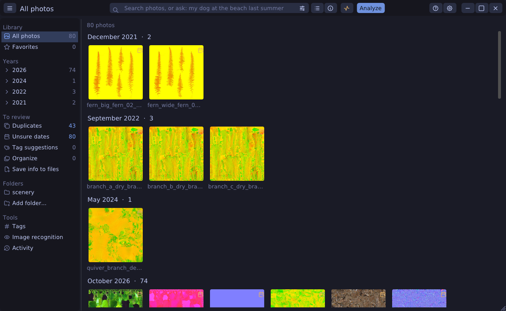
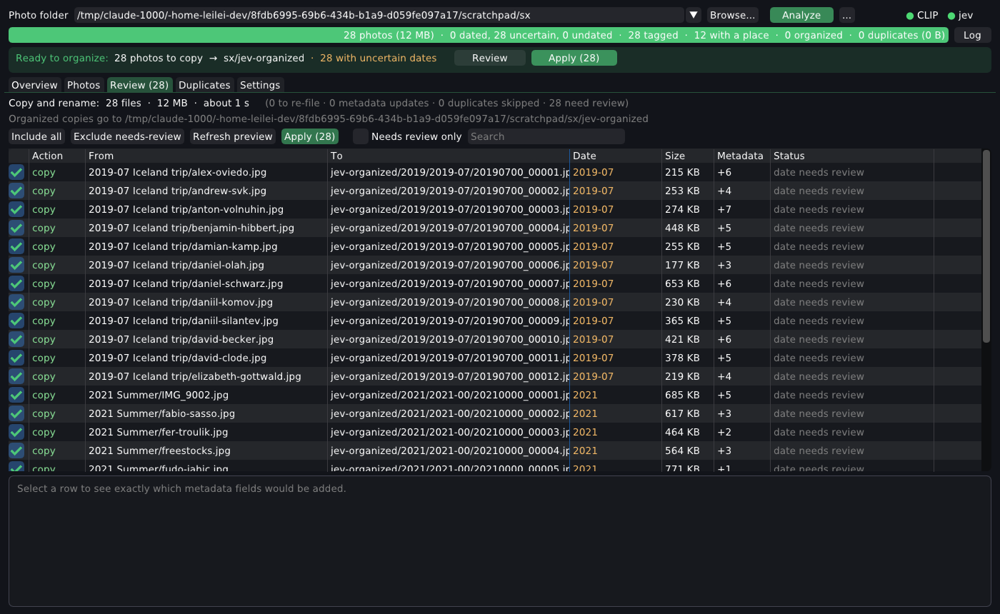
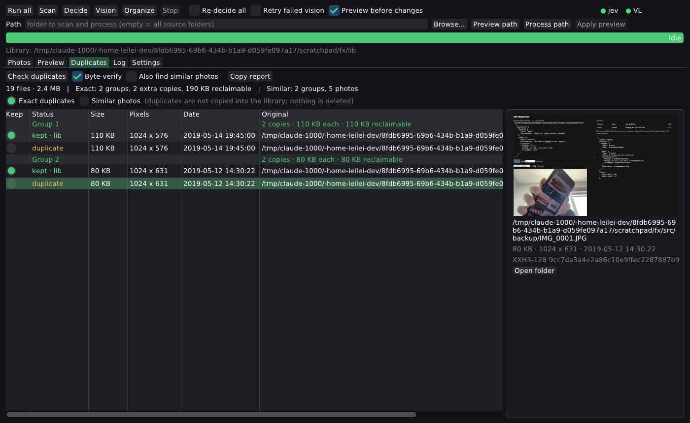
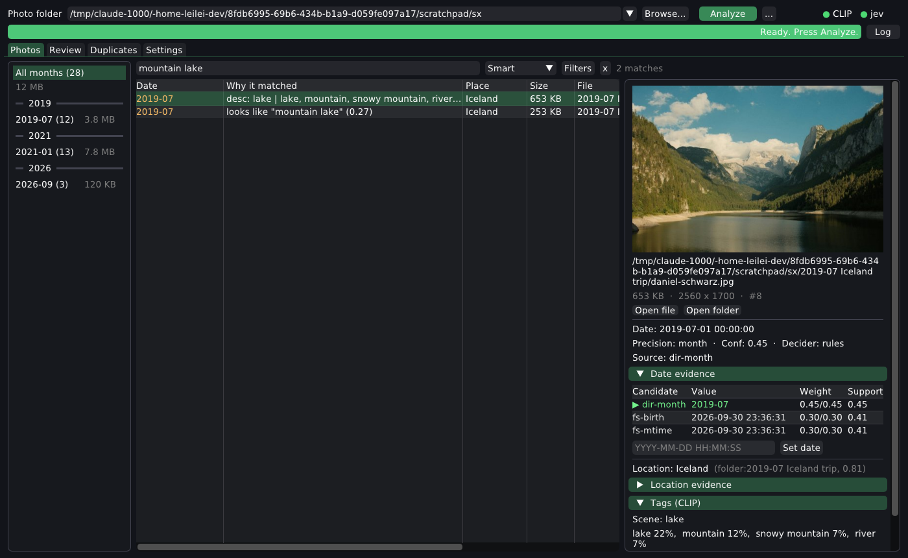
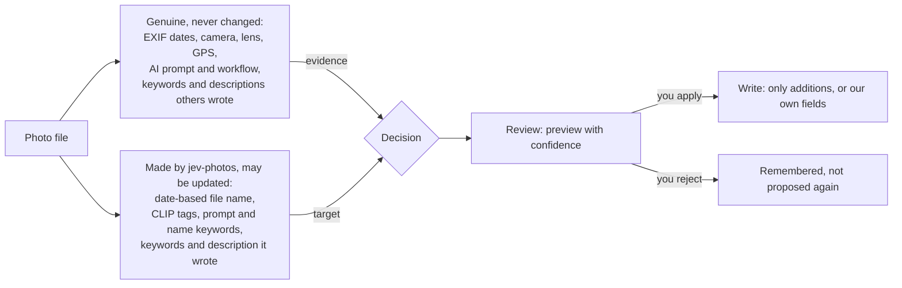
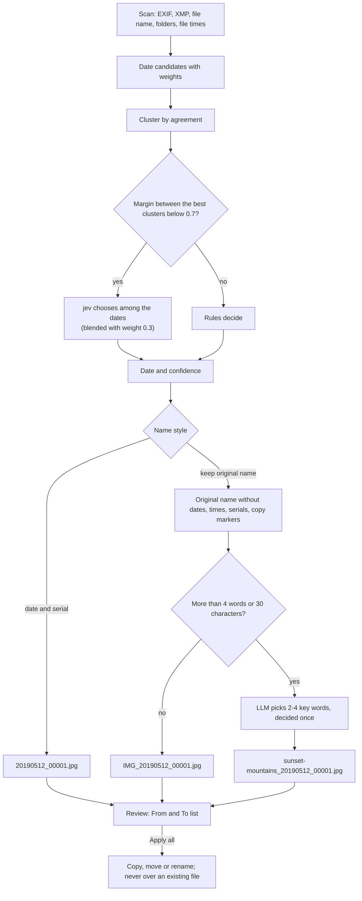
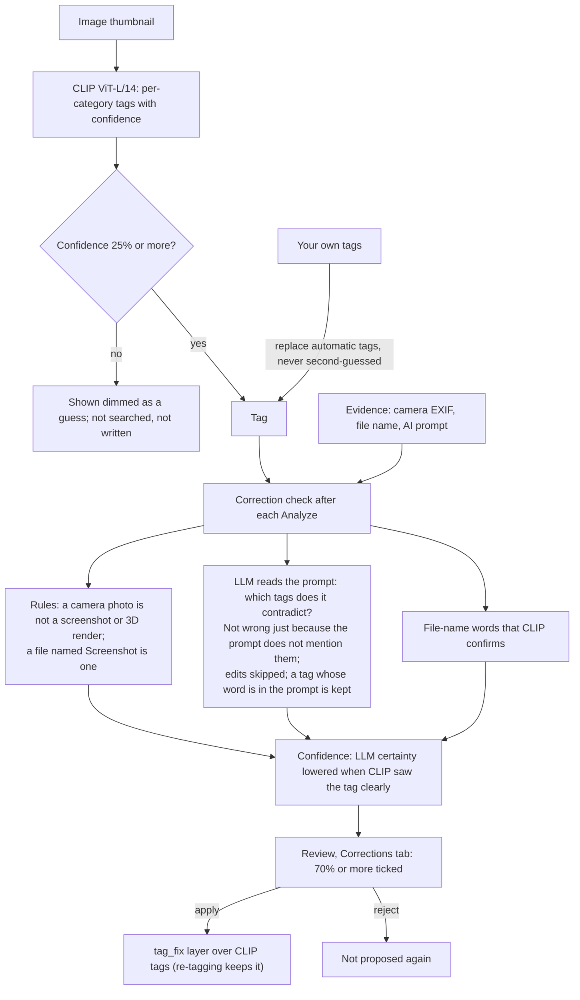
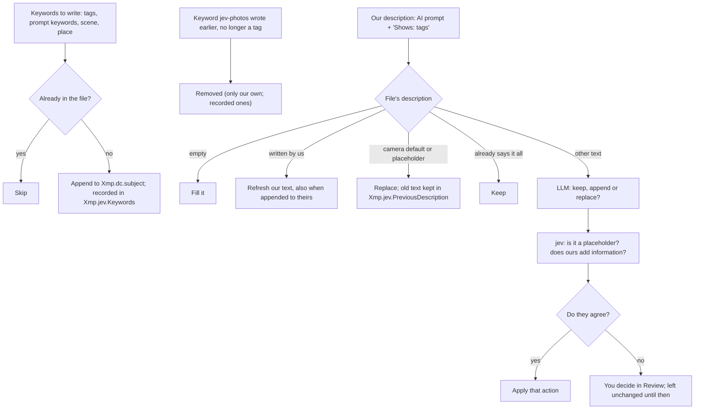

#  jev photos

Organize a messy photo collection by **recovered capture date**, one folder per month, with names like
`20190512_00001.jpg`. Date and location decisions use explainable evidence scoring plus the **jev decision API**.
A **vision-language model** extracts objects, scenes and tags. Everything is indexed in SQLite for search.
Originals are never modified, and existing metadata is never overwritten.



Same stack as [gpu-hud](../../gpu-hud): C++17, Dear ImGui, GLFW, OpenGL 3.3. It adds a vendored SQLite (FTS5) and
the `exiv2` CLI for metadata.

## What it does

| Stage | |
|---|---|
| **1 Scan** | Walks the source folders (JPEG, PNG, HEIC, TIFF, WebP, RAW…), records size and a quick hash (at most 128 KiB read per file) and snapshots all EXIF/IPTC/XMP into the database. Re-runs skip unchanged files. |
| **2 Duplicates** | Finds exact duplicates by size, then quick hash, then full XXH3-128 (only for collisions), then a byte comparison. Optionally finds near duplicates (resized/re-saved copies) by perceptual hash. Duplicates are not copied into jev-organized; nothing is deleted. |
| **2 Decide** | Recovers the capture date from EXIF, XMP, GPS time, file name, folder names, file times and camera-sequence neighbours ([decision model](docs/decision-model.md)). Close calls go to jev. It also decides a location from metadata or folder/file names (rules + VL + jev vote, per folder). |
| **3 Tag (CLIP)** | CLIP on the CPU (ONNX Runtime, full-precision weights), from each photo's 512 px thumbnail: ViT-L/14 (~0.3–0.4 s per photo, the default once downloaded) or ViT-B/32 (~60 ms). It picks tags per category from an editable vocabulary (`~/.config/jev-photos/tags.txt`, ~220 tags: medium, people, clothing, scene, objects, documents, …) and stores the image embedding for search. See [Tags](#tags-and-exif). |
| **3b Vision** (advanced, off) | Optional. A vision-language model (OpenAI-compatible or Ollama) writes captions and reads text in screenshots. It needs a model server and a lot of memory. |
| **4 Organize** | Copies (or moves) into `<photo folder>/jev-organized/2019/2019-05/20190512_00001.jpg`, with the serial per day in time order. Partial dates go to `20190500_…` / `20190000_…`, and undated files to `undated/00000000_…`. Then it extends the metadata of the copy (or an XMP sidecar). |

Each stage is resumable. A manual date override in the UI re-files the organized copy on the next *Decide* + *Organize*.

### Folders

Add any number of photo folders (**+ Add…**, or **Folders** to remove or re-add recent ones). **Analyze scans them
all together**: one duplicate check across all of them, one catalog. The folder selector chooses what the tabs show,
one folder or **All folders**. Each folder's organized copies go to its own `jev-organized` (or all to one folder,
when *Organized copies folder* is set). Removing a folder only takes it off the list. From the command line:
`jev-photos --cli ~/Pictures/phone ~/Pictures/camera` scans both.

### How files are organized

Settings → *File operation*:

| Choice | What happens |
|---|---|
| Copy and rename (default) | originals untouched; renamed copies in `jev-organized/2019/2019-05/20190512_00001.jpg` |
| Move and rename | the originals move into the month folders and get date names; no second copy |
| Rename in place | the originals stay in their folders and only get date names |
| Add metadata only | nothing moves; missing dates, tags, descriptions and places are added where each photo is now |

*Names*: `20190512_00001.jpg`, or **keep the original name** as a prefix. The prefix is the old name without its
dates, times, serial numbers and copy markers: `IMG_20190512_123456.jpg` → `IMG_20190512_00001.jpg`,
`Paris trip 2019-05-12 (3).jpg` → `Paris trip_20190512_00001.jpg`, `Screenshot 2024-01-02 at 10.11.12.png` →
`Screenshot_20240102_00001.png`, `DSC01234.JPG` → `DSC_…`. Both choices sit at the top of the Review tab (and in
Settings); changing one rebuilds the list, and **Apply all** does the renames/copies and the metadata together.

### Preview before anything changes

With **Preview before changes** on (the default), *Organize* never touches a file. It builds a plan, and the **Preview**
tab lists every copy/move, re-file (rename after a date fix) and metadata-only update. Each row shows the exact new
name, the date and its confidence, how many metadata fields will be added and why an item is flagged. Selecting a
row shows the exact exiv2 commands (additions only). You can untick items or use *Exclude needs-review*.
*Refresh preview* renumbers without the excluded items, and **Apply** executes exactly that plan. Before each item,
Apply re-checks that the destination is still free and the source hasn't changed since the scan. Results appear per
row.

The Review tab is a **From → To** table with the total files, bytes and an estimated time (copying ~150 MB/s,
metadata ~40 ms per file). *Move extra copies to Trash…* shows the same kind of table (group, file moving to the
Trash, the copy that stays, size) with totals and a time estimate before anything moves.



### Duplicates, sizes and fast hashing

| Tier | Cost | Purpose |
|---|---|---|
| file size | free (`stat`) | only same-size files can be identical |
| quick hash: XXH3-64 of size + first/last 64 KiB | ≤ 128 KiB read, done during scan | separates almost all same-size files |
| full hash: XXH3-128 of the whole file | only files that still collide; cached in the DB | identity |
| byte-for-byte comparison with the kept copy | only real duplicate candidates (*Byte-verify*, default on) | proof before anything is marked |

On this machine XXH3-128 hashed a 550 MB file at 16.7 GB/s versus 185 MB/s for SHA-256, and most files never
need a full read at all. The **kept copy** is the one you pinned (radio button in the tab), else one already in the
organized folder, else the richest metadata, else a name/folder that doesn't look like a copy (`(1)`, ` copy`, `副本`,
`backup/`, `备份/`), else the oldest file.

**Similar photos** (*Also find similar photos*, or `--similar`): a 64-bit dHash of each image, taken after applying
EXIF orientation so rotated copies match. Photos within the *max distance* (default 6 bits) with matching aspect
ratios are grouped, and the largest is the representative. This catches resized exports, re-compressed chat copies
and burst shots. They are **only reported**, never skipped, and hashes are cached, so re-checks are instant.

The Duplicates tab lists groups by reclaimable space, with size, pixels, date, hash and a preview, and *Copy report*
copies it as CSV. The Photos tab shows each file's size, and the month sidebar shows per-month and total sizes.
`--dupes` prints the groups, and `--stats` includes sizes.



### Search



The Photos tab has one search box over **file and folder names**, **EXIF/IPTC/XMP**, **descriptions** (CLIP tags,
scene, place, captions) and **CLIP embeddings**:

| Mode | Example | |
|---|---|---|
| Smart (default) | `mountain lake`, `(beach \| sea) -night tag:dog` | words or meaning; photos with both rank first; the query language below |
| Words | `iceland "new york" -snow` | every word must appear; quoted phrases, `-word` to exclude |
| Meaning | `kids on a beach at sunset` | what the picture shows (CLIP text ↔ image), even without matching tags |
| Regex | `IMG_20(19|20)` | ECMAScript, case-insensitive |
| Ask (AI) | `my dog at the beach last summer` (Enter) | an LLM turns the sentence into keywords, a picture description, a place and a date range; local search keeps candidates scoring ≥ 50 %; the LLM then rates the candidates in batches of 25, and results rated ≥ 50 % are listed best first |

| Similar | `like:#123`, `like:IMG_0042`, or *Find similar* in a photo's detail | photos that look like that one (CLIP image ↔ image, ≥ 80 % similar) |

**Query language** (Smart and Words; hover the search box for the cheat sheet). Everything combines with `( )`,
`OR`/`|`, `NOT`/`-`/`!` and implicit AND:

| | Syntax | Example |
|---|---|---|
| words, phrases | `word`, `"a phrase"`, `~typo` (close spellings) | `~webiste` finds *website* |
| one field | `tag:` (exact tag) `name:` `desc:` `prompt:` `exif:` `place:` | `tag:"night city" place:tokyo` |
| camera, generator | `camera:` (make, model, lens) `model:` `lora:` | `camera:"x100v"`, `model:sdxl lora:ink` |
| dates | `date:2019`, `date:2019-05`, `date:2019-05-01..2019-08-31`, `date:>2020`, `year:2018..2020` | `date:2021 -is:uncertain` |
| size, shape | `size:>2mb`, `size:100kb..2mb`, `w:>3000`, `h:<1000`, `mp:>12`, `ext:png`, `ext:raw` | `mp:>20 ext:raw` |
| state | `is:fav` `is:ai` `is:untagged` `is:uncertain` `is:undated` `is:portrait` `is:landscape` `is:square` | `is:fav is:portrait` |
| has | `has:gps` `has:prompt` `has:place` `has:tags` `has:desc` `has:keywords` `has:camera` | `is:ai -has:desc` |
| similar | `like:#id`, `like:<part of a file name>` | `like:#42 date:2019` |

Every result says why it matched (`tag: website`, `prompt: …lighthouse…`, `looks like it (94%)`, `3.2 MB`).

**Other languages**: each search term also matches its equivalents in English, Simplified/Traditional Chinese,
Japanese and Korean. The LLM is asked once per term, after typing pauses for 0.7 s, and the answers are cached in the
catalog (`translations`), so 网站, ウェブサイト and 웹사이트 all find the photos tagged `website`, and an English word
finds a Chinese prompt. CLIP reads English, so a query in another language is matched by meaning through its
English equivalent (登录表单 finds the login forms).

**Meaning is a real match, not just a ranking.** The query is scored exactly like a tag: it competes with the
tags of its own category (the category of the nearest vocabulary tag: "puppy" with the animals, "invoice" with the
documents), and that category must really be present in the picture. The confidence is the share inside the
category × the category's presence, and a photo matches at ≥ 30 % (*Meaning search strictness*). Searching
"diagram" no longer returns website screenshots where "diagram" was a 10 % guess next to "website" (it returns
nothing when there are no diagrams), while "login form" finds exactly the sign-up, login and reset-password pages.
The same rule keeps weak tags out of word search: a tag below 25 % is shown dimmed with a `?` but is not searchable.

**Ask** uses any OpenAI-compatible LLM (Settings → Ask search; default the local Qwen3.8 on `:8888`, with thinking
disabled so it answers in about 1 s). The default judge is **LLM + jev**: the LLM rates every candidate, and jev
settles the LLM's close calls (rated 30–70 %). The final rating is the average of both, and the result shows both
(`LLM 60% · jev 92%`). Julia judges each option's text on its own, so every photo becomes a self-contained
statement pair ("A photo with anime, hat, selfie … is / is not what someone searching for "a girl wearing a hat"
wants"), the form it answers well. Other judges: LLM only, jev only, none. Each Ask takes 2–5 s.

### AI images: prompts and generation settings

Image tools store the prompt and settings in the file. **Scan reads them automatically** and stores them in the
catalog (column `gen_json`). These fields are never written to, because other tools (Civitai, ComfyUI, A1111) parse them:

| Tool | Where |
|---|---|
| ComfyUI | PNG text chunk `prompt` (the API graph) + `workflow`; WebP/JPEG EXIF Make/Model `prompt:{…}` |
| A1111 / Forge / Civitai downloads | PNG text `parameters`; JPEG/WebP `Exif.Photo.UserComment` |
| NovelAI, InvokeAI, Fooocus, SwarmUI | PNG text `Comment` / `invokeai_metadata` / `parameters` (JSON) |
| Midjourney | description ending in `Job ID: …` |

For ComfyUI the graph is followed from the sampler's *positive*/*negative* inputs back to the text. This works
through concatenate nodes, primitives, text generators and combined encoders, and it skips zeroed conditioning.
It also records the checkpoint/UNet, LoRAs with strengths, seed (through seed nodes), steps, CFG, sampler, latent size
and input images (edits). exiv2 does not read PNG text chunks, so before this nothing of it was in the catalog.

* **Search**: prompts are a search field (*Filters → AI generation prompts*) and are in Ask's candidate
  descriptions; results say `prompt: …matched words…`. The model and LoRA names are searchable too.
* **Keywords**: tag-style prompts (`1girl, red hat, beach`, also `、`/`，` separated) give their words directly, with
  quality boilerplate dropped. Prose prompts are summarised by the LLM into up to 10 keywords, once per distinct
  prompt (a batch of renders usually shares one). They are searchable and written as keywords. The LLM may decline
  explicit prompts; those photos are retried on the next run, and their prompt text stays searchable.
* **Shown** in the photo's detail and the Tags & EXIF tab (prompt with *Copy*, negative prompt, model, LoRAs, seed,
  steps, CFG, sampler, size, source images); *AI-generated* filter, and the tool name in the file column.

### Descriptions

With *Write a description* on, jev-photos writes to `Xmp.dc.description` (the standard field that Windows, Lightroom
and digiKam show): the cleaned prompt for AI images, the caption if any, and `Shows: <tags>`. In a PNG, exiv2 adds an
XMP chunk and leaves the `prompt`/`workflow` chunks byte-identical (checked). What happens to a description the file
already has:

1. Empty field: filled.
2. Text jev-photos wrote itself (recorded in `Xmp.jev.Description`): refreshed when the tags change, including when
   it was appended after someone else's text.
3. Rules: a camera default or placeholder (`OLYMPUS DIGITAL CAMERA`, `SONY DSC`, `IMG_2041`, the file name) is
   **replaced**. Text that already contains everything ours says is **kept**.
4. Otherwise, by *Settings → Existing descriptions* (default: **Rules + LLM, jev cross-checks**). The LLM chooses
   keep / append / replace. jev answers two yes/no statements ("is this a placeholder?", "does ours add
   information?"). When they agree, the choice is applied. When they disagree, the photo is marked **you decide**
   in Review (*N descriptions to decide*, buttons keep / append / replace), and it stays unchanged until you choose.
   Other settings: only fill empty fields; Rules + LLM; always ask.

*Replace* always keeps the old text in `Xmp.jev.PreviousDescription`. Choices are remembered per (old text, new
text) pair, and jev's answers appear in *How jev helped*. Measured: Julia alone gets this wrong. It called
"OLYMPUS DIGITAL CAMERA" a real description and says new text "adds information" almost every time, so it never
decides alone. It does catch LLM mistakes, though: the LLM wanted to replace "Molar about page", jev said keep, and
it went to the user.

### Corrections (review before anything changes)

Every Analyze ends with a **check** of what jev-photos generated itself. It produces specific proposals with a
confidence of how sure it is that each change is right and worth making. They are listed in **Review →
Corrections**; proposals at 70 % or more are ticked, and you apply or reject them. Rejected proposals are not made
again. The file's own metadata (prompt, camera, lens, original dates, descriptions others wrote) is only used as
evidence and is never a target. Only generated data is: CLIP tags, and the names jev-photos gave.

| Evidence | Proposal |
|---|---|
| camera EXIF (Make + exposure/lens) | remove art/screen tags (`screenshot`, `anime`, `3d render`…) from camera photos |
| file name says screenshot (also 截屏 / 截图 / スクリーンショット / 스크린샷) | add `screenshot` |
| AI prompt, judged by the LLM | remove tags the prompt contradicts (a `screenshot` tag on a "cinematic close-up"); never a tag whose word is in the prompt, never just because the prompt doesn't mention it; edits (img2img) are skipped, since their look comes from the source |
| file-name words that CLIP confirms | add them as tags |
| a long original name kept as prefix | rename the organized file to its key words |

Confidence combines the LLM's certainty with how strongly CLIP saw the tag (a tag CLIP saw clearly needs a stronger
case). Accepted tag changes are a layer (`tag_fix`) over CLIP's own tags, so re-tagging keeps them. Files get the
corrected keywords the next time you apply *Add metadata only*. Unchanged photos are not re-checked;
*Check again* re-checks all of them. On the test folder the first check took about 1.5 minutes (one LLM call
per distinct prompt and tag set) and proposed 24 fixes, such as removing `screenshot` from ten portrait renders.

**File names as keywords**: the words of a file name (not dates, serials, ids, hashes or camera prefixes) are stored
and searchable. A long name (more than 4 words or 30 characters) is reduced by the LLM to its 2–4 key words. With
*keep the original name*, those key words become the prefix: `a_beautiful_sunset_over_the_mountains_4k.jpg` →
`sunset-mountains_20190512_00001.jpg`.

### Favorites

Click the star in the Photos table (or press **f**, also in the viewer). The **★ Favorites** tab shows starred photos
as a thumbnail grid (arrows, Enter to view, f to unstar, right-click). Tags have stars too, in the detail panes:
starred tags become one-click filter chips under the search box and in Favorites. `is:fav` finds favorites in
any search.

### What jev decides

jev is asked only where the rules are unsure, and every answer is kept (table `decisions`) and shown:

| Where | Question | How it counts |
|---|---|---|
| Dates | which candidate date is real, when the evidence clusters are close (margin < 0.7) | blended with weight 0.3 |
| Places | which folder name is a place (or none) | one vote next to the rules (0.15) |
| Ask search | is this photo what the user wants (the LLM's 30–70 % close calls) | averaged with the LLM |
| Existing descriptions | is it a placeholder, does ours add information | must agree with the LLM, else you decide |

Overview → **How jev helped** counts the decisions per kind and how many **changed** the outcome; *Show decisions*
lists each one: what the rules or the LLM said, what jev chose with its probabilities (hover), and the result. A
photo's detail pane lists the jev decisions about it. jev is not used for tags: given file names as context,
Julia called ComfyUI renders "real photos taken with a camera" with 93 % confidence.

### Tags and EXIF

The **Tags & EXIF** tab lists every photo with its tags (confidence, dimmed guesses, `*` = made with an older tag
list), the date and what the file itself carries (date, keywords, description, place). Filters:
no tags, weak tags only, older tag list, edited by me, no date/keywords/description/place in the file.

* **Tag untagged photos** runs CLIP on new photos and refreshes tags made with an older vocabulary. **Re-tag all**
  recomputes every photo's tags from its stored embedding (no image is read again, so it takes seconds). Editing
  `tags.txt` takes effect the same way.
* **Edit tags**: type your own comma-separated tags for a photo. They replace the automatic ones in search and in
  the files, and *Back to automatic tags* undoes that.
* **Fill in missing metadata…** builds the *Add metadata only* list in Review: every date, keyword, description
  and place that would be added. The detail pane shows the exact change for the selected photo before you apply.
* **Rewrite tags**: keywords jev-photos wrote on an earlier run are recorded in `Xmp.jev.Keywords`. When the tags
  improve, those keywords (and only those) are replaced. Keywords the file had on its own are never touched. For
  copies made before this record existed, "ours" is whatever the copy has beyond the original's keywords.

*Filters* chooses which fields words and regexes look in, a **taken between** start and end date (calendar picker;
year-only and month-only dates count when their period overlaps) and "only uncertain dates". Every result
says why it matched (`desc: lake | lake, mountain…`, `exif: Exif.Image.Model = Canon…`, `looks like "mountain lake"
(0.27)`). From the command line:
`jev-photos FOLDER --search "sunset over the sea" [--mode smart|keyword|semantic|regex|ask] [--in name,exif,desc] [--from 2019-05-01 --to 2019-08-31 | --years 2018-2021]`.

**Non-destructive by design**
* Default *Copy*: source files are only read. The end-to-end test checks their SHA-256 before and after.
* Copies keep the source mtime, are written via `.part` + `link()`, and never replace an existing file.
* Metadata is only added: a field with a value is never changed. A camera's bogus `DateTimeOriginal` stays, and the
  recovered date goes to `Xmp.photoshop.DateCreated` (if missing) and `Xmp.jev.*`.
* Formats exiv2 cannot write get a sidecar. If that fails too, the error is logged and skipped.

## How updates are decided

jev-photos separates what a file **is** (its own metadata, never rewritten) from what jev-photos **made** (names,
tags, keywords and descriptions it generated, which may be refreshed or corrected). Every change is shown in Review
before it happens.



### File names



### Tags and corrections



### Writing keywords and descriptions (EXIF / XMP)



Settings → *Existing descriptions* can also be: only fill empty fields, LLM alone, or always ask. In PNGs the
generation chunks (`prompt`, `workflow`, `parameters`) are never touched: XMP goes in its own chunk.

## Build

```bash
./build.sh
```

This fetches pinned ImGui, GLFW, stb, SQLite 3.50.4, nlohmann/json and xxHash 0.8.3 into `third_party/`, and X11/GL headers if
missing (no root needed). Runtime needs `exiv2` (`sudo apt install exiv2`); `ffmpeg` is optional for exotic formats.

```bash
build/jev-photos-tests      # decision-model and metadata-safety unit tests
scripts/test-display.sh     # private virtual display :99 for GUI tests; then e.g.
DISPLAY=:99 LIBGL_ALWAYS_SOFTWARE=1 __GLX_VENDOR_LIBRARY_NAME=mesa build/jev-photos --ui-script "tab:photos,j,Return,shot:/tmp/v.png,Escape"
```

## Run

```bash
build/jev-photos                  # GUI
build/jev-photos ~/Pictures/phone # GUI, opened on that folder
scripts/install-desktop.sh        # icon, application-menu entry and a desktop shortcut (--remove undoes it)
```

There is one thing to choose: the **Photo folder** (type it, pick it with *Browse…*, or reopen one from the ▾ recent
list). Press **Analyze**. It scans, finds duplicates, works out dates and places, tags the pictures and plans the
copies. The run ends in the **Review** tab, and a banner offers **Apply**. Nothing is copied before that. Organized copies go to `<photo folder>/jev-organized/2019/2019-05/20190512_00001.jpg`.
That folder is skipped when the photo folder is scanned again, and Settings → Output can put the copies elsewhere.
Your photos themselves are never changed.

**Overview** (the home tab) lists what the analysis found and the next step for each part, with its button:
analyze, check uncertain dates, duplicates, organize (Review / Apply), find photos. Duplicates are left out of the
organized copies automatically. *Move extra copies to Trash…* first lists every file and the copy that stays, then
moves them to the desktop Trash, so they can be restored. Without a Trash they go to `jev-duplicates/`. Nothing is
ever deleted outright.

**Viewing and keys:** double-click a row (Photos, Review, Duplicates) or press Enter to open the viewer.

| Key | Lists | Viewer |
|---|---|---|
| ↓ / j, ↑ / k | next / previous row | next / previous photo |
| → / l, ← / h | next / previous month (Photos), page (Review, Duplicates) | next / previous photo |
| Enter | open viewer | |
| Space | tick / untick (Review) | next photo |
| Esc / q | | close |

*…* runs a single step. The status line shows progress; *Log* opens the log. The Photos, Duplicates and Preview
tabs show only the chosen folder. Everything the app learns (dates, hashes, tags) is kept in one catalog,
`~/.local/share/jev-photos/catalog.sqlite`, so switching folders or re-running is instant.

Headless (same pipeline, terminal progress bar):

```bash
build/jev-photos --cli ~/Pictures/phone --dry-run                # print the preview, change nothing
build/jev-photos --cli ~/Pictures/phone                          # do it (copies -> ~/Pictures/phone/jev-organized)
build/jev-photos --cli ~/Pictures/phone --out /mnt/sorted        # copies somewhere else
build/jev-photos --cli ~/Pictures/phone --stages vision,organize # add tags later
build/jev-photos --cli ~/Pictures/phone --stages scan,dupes --similar   # duplicate check only
build/jev-photos ~/Pictures/phone --dupes                        # print duplicate / similar groups
build/jev-photos ~/Pictures/phone --stats                        # counts and sizes per month
build/jev-photos ~/Pictures/phone --search "beach sunset"
build/jev-photos --explain "~/Pictures/2019-05 Paris trip/IMG_0003.JPG" --root ~/Pictures
```

`--dry-run` prints the preview (planned copies, renames and metadata additions and removals) and changes nothing.
`--op copy|move|rename|metadata` chooses what Organize does, `--names date|keep` the naming, `--write sidecar|db`
where metadata goes, `--no-rewrite` keeps earlier keywords, `--retag` recomputes all tags, and `--no-vision` /
`--no-jev` switch the models off for one run.

```
build/jev-photos --cli ~/Pictures/phone --op rename --names keep --dry-run   # IMG_20190512_123456 -> IMG_20190512_00001
build/jev-photos --cli ~/Pictures/phone --stages organize --op metadata      # only fill in missing fields
build/jev-photos --cli ~/Pictures/phone --stages tag --retag                 # re-tag after editing tags.txt
```

## Settings (`~/.config/jev-photos/config.ini`, mode 0600)

| Key | Default | |
|---|---|---|
| `jev_url`, `jev_model`, `jev_key` | `http://127.0.0.1:8011`, `julia-1` | any djev/laya/julia `/v1/systemone` server |
| `vl_url`, `vl_model`, `vl_key` | `http://127.0.0.1:11434/v1`, Qwen3-VL-8B (Ollama) | any OpenAI-compatible `/chat/completions` (vLLM, llama.cpp, OpenAI…) |
| `vl_max_side`, `vl_concurrency`, `vl_tag_lang` | 1024, 1, English | set `vl_tag_lang=Chinese` for Chinese tags |
| `layout` | 0 | 0 `2019/2019-05`, 1 `2019-05`, 2 `2019/05` |
| `write_mode` | 0 | 0 embed into the organized copy, 1 XMP sidecar, 2 database only |
| `file_op` | 0 | 0 copy, 1 move, 2 rename in place, 3 metadata only |
| `name_style`, `rewrite_tags` | 0, 1 | 0 `20190512_00001`, 1 keep the original name as prefix; replace keywords written earlier |
| `clip_model`, `clip_threads` | auto, 8 | auto = ViT-L/14 when downloaded (`scripts/fetch-models.sh l14`), else ViT-B/32 |
| `write_description`, `desc_policy`, `gen_keywords` | 1, 1, 1 | description writing; 0 fill only, 1 LLM + jev agree, 2 LLM, 3 always ask; prompt keywords |
| `search_min_match`, `ask_judge` | 0.30, 3 | meaning-match threshold; Ask judge 0 LLM, 1 jev, 2 none, 3 LLM + jev close calls |
| `review_below`, `jev_margin`, `jev_date_weight` | 0.55, 0.70, 0.30 | date decision knobs |
| `loc_w_rules`, `loc_w_vl`, `loc_w_jev`, `loc_accept` | 0.25, 0.60, 0.15, 0.50 | location vote |

https URLs go through `curl`, with the API key passed in a 0600 config file rather than on the command line.

## Database

`~/.local/share/jev-photos/catalog.sqlite` (override with `--db`):
* `photos`: source path, size, quick/full hash (`quick_hash`, `content_hash`), dHash, `dup_of`/`similar_to`, dimensions, original metadata snapshot (JSON), decided date/precision/source/
  confidence/evidence, GPS, location, vision fields, organized path, serial, and metadata write state.
* `dirs`: the per-folder location decisions with their vote evidence.
* `decisions`: every jev question: kind, subject, options with jev's probabilities, the rules'/LLM's answer, jev's
  pick, the result and whether jev changed it.
* CLIP columns: `clip_model`, `clip_vec` (embedding), `clip_tags` (`[[tag, confidence], …]`), `clip_vocab`
  (vocabulary hash; stale tags are recomputed), `user_tags` (your own list).
* `photos_fts`: an FTS5 trigram index over caption, scene, objects, tags, landmark, location, text and names. Search
  terms shorter than three characters (e.g. `西湖`) fall back to `LIKE`.

```sql
SELECT date_value, location, tags, dest_path FROM photos
WHERE id IN (SELECT rowid FROM photos_fts WHERE photos_fts MATCH '"sunset"');
```

## Layout

```
src/dates.*      capture-date evidence, scoring, jev blending
src/location.*   place candidates from names, weighted vote
src/meta.*       exiv2 read, additive write, sidecars
src/jev.*        /v1/systemone client       src/vision.*  VL client, image prep (stb, exiv2 previews, ffmpeg)
src/db.*         SQLite schema and queries  src/pipeline.* the stages, progress, bulk-copy detection, neighbour pass
src/dupes.*      keeper choice, dHash, near-duplicate clustering
src/main.cpp     ImGui UI and CLI           tests/        unit tests, fixture generator
```
